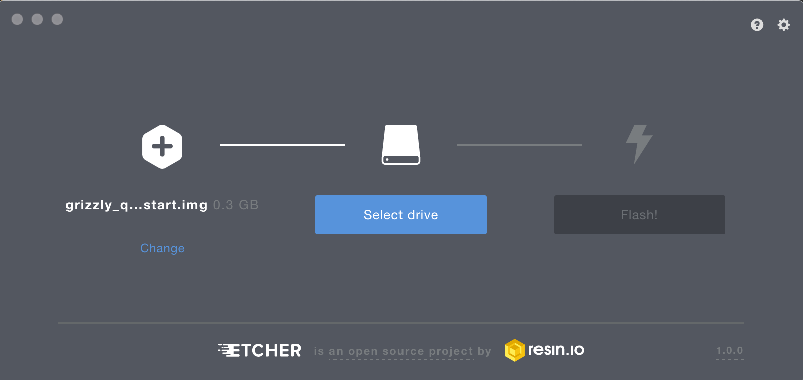

# Grizzly Quick Start Firmware

The Grizzly quickstart firmware lets you try out the Grizzly library on real
hardware without needing to create a Nerves project. Within minutes, you'll
have a device running Nerves. You'll be able to explore the Nerves environment
with toolshed, and control Z-Wave devices from the device itself.

## Prerequisites

To work through this tutorial, you'll need any Raspberry Pi 3. The firmware is
configured to use HDMI output, so a HDMI monitor and keyboard. Also, if you have
Ethernet available you may use ssh over Ethernet to connect to the board.

For this tutorial, you'll also need

* 1 MicroSD card
* [fwup](https://github.com/fhunleth/fwup) or [etcher](https://www.balena.io/etcher/) for burning firmware to the MicroSD card
* [Z-Wave Bridge Controller](https://www.digikey.com/products/en?mpart=ACC-UZB3-U-BRG&v=336)

## Downloading the Firmware

Find the appropriate firmware or zip file
[here](https://github.com/elixir-circuits/circuits_quickstart/releases). If
you're using `fwup` to write images to MicroSD cards, download the `.fw`
extension and if you're using `etcher`, get the `zip` file.

## Burning the Firmware

Navigate to the directory where you downloaded the firmware. We'll go through
both `fwup` and `etcher` methods.

To be clear, this formats your SD card, and you will *lose all data on the SD
card*. Make sure you're OK with that.

### `fwup`

```console
λ ~/fwup circuits_quickstart_rpi0.fw
Use 15.84 GB memory card found at /dev/rdisk2? [y/N] y
```

Depending on your OS, you'll likely be asked to authenticate this action. Go
ahead and do so.

```console
|====================================| 100% (31.81 / 31.81) MB
Success!
Elapsed time: 3.595 s
```

It's quite fast. Now you have Nerves ready to run on your device.  Skip ahead to
the next section.

### `etcher`

Start `etcher`, point it to the zip file, and follow the prompts:




